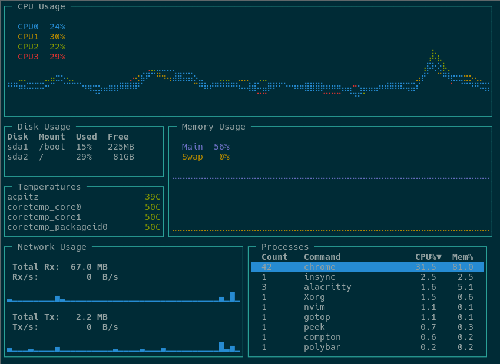
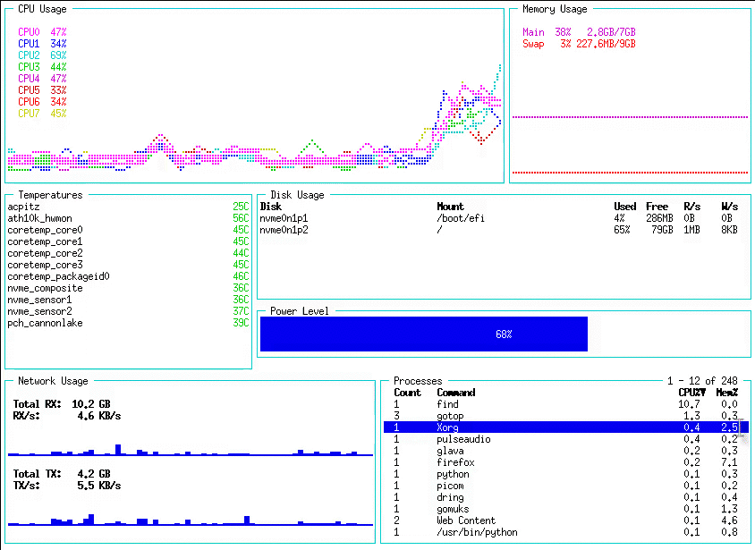
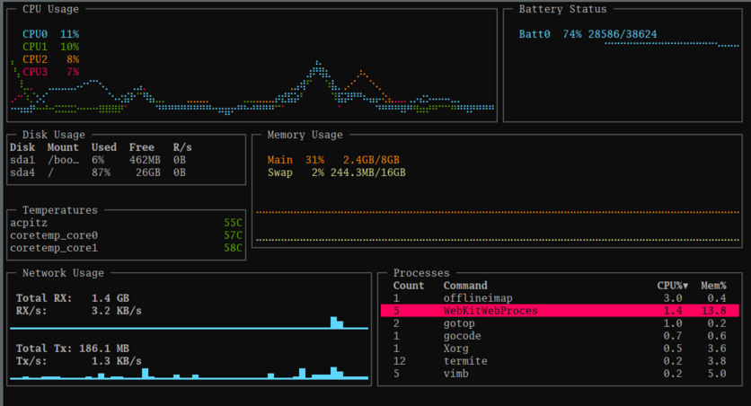

<div align="center">

<a href="./assets/logo">
    
</a>
<br><br>

Another terminal based graphical activity monitor, inspired by [gtop](https://github.com/aksakalli/gtop) and [vtop](https://github.com/MrRio/vtop), this time written in [Go](https://golang.org/)!

Join us in [\#gotop:matrix.org](https://riot.im/app/#/room/#gotop:matrix.org) ([matrix clients](https://matrix.to/#/#gotop:matrix.org)).


<div id="release" align="center">Current release: <a href="https://github.com/xxxserxxx/gotop/releases/tag/v4.0.1">v4.0.1</a></div>

See the [mini-blog](https://github.com/xxxserxxx/gotop/wiki/Micro-Blog) for updates on the build status, and the [change log](/CHANGELOG.md) for release updates.



</div>

## Installation

Working and tested on Linux, FreeBSD and MacOS. Windows binaries are provided, but have limited testing. OpenBSD works with some caveats; cross-compiling is difficult and binaries are not provided.

If you install gotop by hand, or you download or create new layouts or colorschemes, you will need to put the layout files where gotop can find them.  To see the list of directories gotop looks for files, run `gotop -h`.  The first directory is always the directory from which gotop is run.

-  **Arch**: Install from AUR, e.g. `yay -S gotop-bin`. There is also `gotop` and `gotop-git`
-  **Gentoo**: gotop is available on [guru](https://gitweb.gentoo.org/repo/proj/guru.git) overlay. 
    ```shell
    sudo layman -a guru
    sudo emerge gotop
    ```
- **OSX**: gotop is in *homebrew-core*.  `brew install gotop`.  Make sure to uninstall and untap any previous installations or taps.
- **Prebuilt binaries**: Binaries for most systems can be downloaded from [the github releases page](https://github.com/xxxserxxx/gotop/releases). RPM and DEB packages are also provided.
- **Source**: This requires Go >= 1.14. `go get -u github.com/xxxserxxx/gotop/cmd/gotop`

### Extension builds

An evolving mechanism in gotop are extensions. This is designed to allow gotop to support feature sets that are not universally needed without blowing up the application for average users with usused features.  Examples are support for specific hardware sets like video cards, or things that are just obviously not a core objective of the application, like remote server monitoring.

The path to these extensions is a tool called [gotop-builder](https://github.com/xxxserxxx/gotop-builder). It is easy to use and depends only on having Go installed.  You can read more about it on the project page, where you can also find binaries for Linux that have *all* extensions built in. If you want less than an all-inclusive build, or one for a different OS/architecture, you can use gotop-builder itself to create your own.


### Console Users

gotop requires a font that has braille and block character Unicode code points; some distributions do not provide this.  In the gotop repository is a `pcf` font that has these points, and setting this font may improve how gotop renders in your console.  To use this, run these commands:

```shell
curl -O -L https://raw.githubusercontent.com/xxxserxxx/gotop/master/fonts/Lat15-VGA16-braille.psf
setfont Lat15-VGA16-braille.psf
```

### Building

This is the download & compile approach.

gotop should build with most versions of Go.  If you have a version other than 1.14 installed, remove the `go` line at the end of `go.mod` and it should work.

```shell
git clone https://github.com/xxxserxxx/gotop.git
cd gotop
sed -i '/^go/d' go.mod          # Do this if you have go != 1.14
VERS="$(git tag -l --sort=-v:refname | sed 's/v\([^-].*\)/\1/g' | head -1 | tr -d '-' ).$(git describe --long --tags | sed 's/\([^-].*\)-\([0-9]*\)-\(g.*\)/r\2.\3/g' | tr -d '-')"
DAT=$(date +%Y%m%dT%H%M%S)
go build -o gotop \
	-ldflags "-X main.Version=v${VERS} -X main.BuildDate=${DAT}" \
	./cmd/gotop
```

Move `gotop` to somewhere in your `$PATH`.

If Go is not installed or is the wrong version, and you don't have root access or don't want to upgrade Go, a script is provided to download Go and the gotop sources, compile gotop, and then clean up. See `scripts/install_without_root.sh`.

#### go generate

Apple SMC tags are embedded in a text file that is compiled into the executable; the same happens with the language translations.  When the file `devices/data/sm.tsv` or any translations in `translations/dicts/` change, `go generate` should be re-run.

## Usage

Run with `-h` to get an extensive list of command line arguments.  Many of these can be configured by creating a configuration file; see the next section for more information.  Key bindings can be viewed while gotop is running by pressing the `?` key, or they can be printed out by using the `--list keys` command.

In addition to the key bindings, the mouse can be used to control the process list:

- click to select process
- mouse wheel to scroll through processes

For more information on other topics, see:

- [Layouts](docs/layouts.md)
- [Configuration](docs/configuration.md)
- [Color schemes](docs/colorschemes.md)
- [Device filtering](docs/devices.md)
- [Extensions](docs/extensions.md)


## More screen shots

#### '-l kitchensink' + colorscheme


#### "-l battery"


#### "-l minimal"


#### Custom (layouts/procs)


## Built With

- [gizak/termui](https://github.com/gizak/termui)
- [nsf/termbox](https://github.com/nsf/termbox-go)
- [exrook/drawille-go](https://github.com/exrook/drawille-go)
- [shirou/gopsutil](https://github.com/shirou/gopsutil)
- [goreleaser/nfpm](https://github.com/goreleaser/nfpm)
- [distatus/battery](https://github.com/distatus/battery)
- [VictoriaMetrics/metrics](https://github.com/VictoriaMetrics/metrics) Check this out! The API is clean, elegant, introduces many fewer indirect dependencies than the Prometheus client, and adds 50% less size to binaries.
- [lingo-toml](https://github.com/jdkeke142/lingo-toml) provides the translation support library.

## History

**ca. 2020-01-25** The original author of gotop started a new tool in Rust, called [ytop](https://github.com/cjbassi/ytop), and deprecated his Go version.  This repository is a fork of original gotop project with a new maintainer to keep the project alive and growing.  An objective of the fork is to maintain a small, focused core while providing a path to extend functionality for less universal use cases; examples of this is sensor support for NVidia graphics cards, and for aggregating data from remote gotop instances.

## Alternatives

I obviously think gotop is the Bee's Knees, but there are many alternatives. Many of these have been around for years. All of them are terminal-based tools.

- Grandpa [top](http://sourceforge.net/projects/unixtop/). Written 36 years ago, C, installed by default on almost every Unix decendant.
- [htop](https://hisham.hm/htop/). A prettier top. Similar functionality. 16 years old!
- [atop](https://www.atoptool.nl/). Detailed process-focused inspection with a table-like view. Been around for 9 long years.
- [iftop](http://www.ex-parrot.com/~pdw/iftop/), a top for network connections.  More than just data transfer, iftop will show what interfaces are connecting to what IP addresses. Requires root access to run.
- [iotop](http://guichaz.free.fr/iotop/), top for disk access. Tells you *which* processes are writing to and from disk space, and how much. Also requires root access to run.
- [nmon](http://nmon.sourceforge.net) a dashboard style top; widgets can be dynamically enabled and disabled, pure ASCII rendering, so it doesn't rely on fancy character sets to draw bars. 
- [bashtop](https://github.com/aristocratos/bashtop), in pure bash! Beautiful and space efficient, and [deserves special comment](docs/bashtop.md).  If you use anything other than gotop, I'd recommend bashtop.
- [ytop](https://github.com/cjbassi/ytop), a rewrite of gotop (ca. 3.0) in Rust.  Same great UI, different programming language.
- [slabtop](https://gitlab.com/procps-ng/procps), part of procps-ng, looks like top but provides kernel slab cache information! Requires root.
- [systemd-cgtop](https://www.github.com/systemd/systemd), comes with systemd (odds are your system uses systemd, so this is already installed), provides a resource use view of control groups -- basically, which services are using what resources. Does *not* require root to run.
- [virt-top](https://libvirt.org/) top for virtualized containers (VMs, like QEMU).
- [ctop](https://bcicen.github.io/ctop/) top for containers (LXC, like docker)


### A comment on clones

In a chat room I heard someone refer to gotop as "another one of those fancy language rewrites people do."  I'm not the original author of gotop, so it's easy to not take offense, but I'm going on record as saying that I disagree with that sentiment: I think these rewrites are valuable, useful, and healthy to the community. They increase software diversity at very little [cost to users](https://en.wikipedia.org/wiki/Information_overload), and are a sort of evolutionary mechanism: as people do rewrites, some are worse, but some are better, and users benefit.  Rewrites provide options, which fight against [monocultures](https://github.com). As importantly, most developers are really only fluent in a couple of programming languages. We all have *familiarity* with a dozen, and may even have extensive experience with a half-dozen, but if you don't constantly use a language, you tend to forget the extended library APIs, your development environment isn't tuned, you're rusty with using the tool sets, and you may have forgotten a lot of the language peculiarities and gotchas. The barrier to entry for contributing to a software project -- to simply finding and fixing a bug -- in a language you're not intimate with can be very high. It gets much worse if the project owner is a stickler for quality and style.  So I believe that gotop's original author's decision to rewrite his project in Rust is a net positive. He probably made fewer design mistakes in ytop (we always do, on the second rewrite), and Rust developers -- who may have hesitated learning or brushing up on Go to submit an improvement -- have another project to which they can contribute.

Diversity is good. Don't knock the free stuff.


## Stargazers over time

[](https://starcharts.herokuapp.com/xxxserxxx/gotop)
