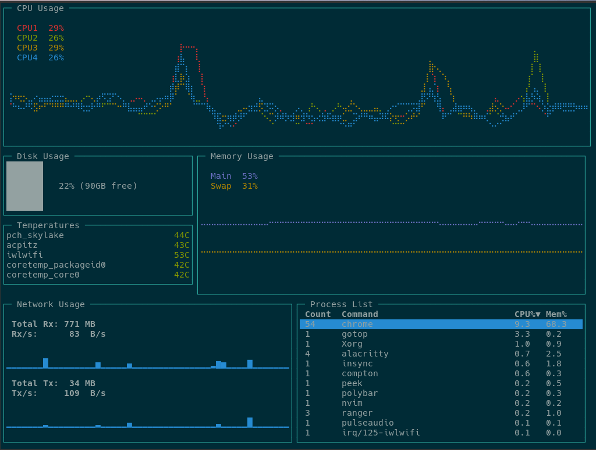

# gotop



Another TUI graphical activity monitor, inspired by [vtop](https://github.com/MrRio/vtop) and [gtop](https://github.com/aksakalli/gtop), this time written in [Go](https://golang.org/)!  
Built with [gopsutil](https://github.com/shirou/gopsutil), [drawille-go](https://github.com/exrook/drawille-go), and a heavily modified version of [termui](https://github.com/gizak/termui) which uses [termbox-go](https://github.com/nsf/termbox-go).


## Installation

Go compiles to a single executable so you just need to get that into your $PATH.

To download the latest binary for your OS into `/usr/bin`, you can run the [install.sh](https://github.com/cjbassi/gotop/blob/master/install.sh) script like so:

```
curl https://raw.githubusercontent.com/cjbassi/gotop/master/install.sh | sudo bash
```

If you install this way, starting gotop with the `-u` flag or pressing `u` in gotop will check to see if there is a newer version available and automatically update if so.

To uninstall, run:

```
sudo rm /usr/bin/gotop
```


### Arch Linux

Alternatively, if you're on Arch Linux you can install the `gotop` package from the AUR.


## Keybinds

* Quit: `q` or `Ctrl-c`
* Navigation:
    * `<up>`/`<down>` and `j`/`k`: up and down
    * `C-d` and `C-u`: up and down half a page
    * `C-f` and `C-b`: up and down a full page
    * `gg` and `G`: jump to top and bottom
* Process Sorting:
    * `c`: CPU
    * `m`: Mem
    * `p`: PID
* `<tab>`: toggle process grouping
* `dd`: kill the selected process or process group
* `<left>`/`<right>` and `h`/`l`: zoom in and out of graphs
* `?`: toggles keybind help menu
* `u`: update gotop


## Mouse Control

* mouse wheel to scroll Process List
* click to select process


## Colorschemes

A different Colorscheme can be set with the `-c` flag followed its name. You can find them in the `colorschemes` folder.
Feel free to add a new one. You can use 256 colors, bold, underline, and reverse. More info [here](https://godoc.org/github.com/nsf/termbox-go#Attribute) and [here](https://godoc.org/github.com/nsf/termbox-go#OutputMode) under 'Output256'.


## TODO

* Network Usage
    - increase height of sparkline depending on widget size
* Process List
    - memory total goes above 100%
    - extract out column position logic into a function
* Disk Usage
    - color percentage
    - change bar color to white
* CPU Usage
    - Support colors for more CPU cores
* general
    - option to set polling interval for CPU and mem
    - more themes
    - zooming in and out of graphs
    - updating
    - option to only show processes, CPU, and mem
    - gif of gotop
    - more packages
* cleaning up code
    - termui Blocks should ignore writing to the outside area
        - Ignore writes to outside of inner area, or give error?
    - termui Blocks should be indexed at 0, and maybe change X and Y variables too
    - remove gotop unique logic from termui widgets
    - try to get drawille fork merged upstream
    - more documentation
    - Draw borders and label after other stuff
    - Only merge stuff in the range
    - Merge should include offset
    - Remove merge from grid buffer function, just render
    - Remove merge altogether


## License

AGPLv3
