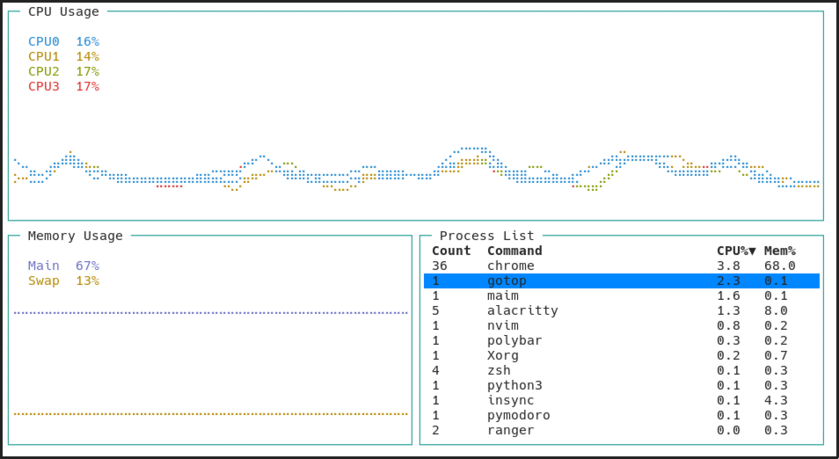

### **NO LONGER MAINTAINED.** A maintained fork of gotop exists at https://github.com/xxxserxxx/gotop.

<div align="center">

<a href="./assets/logo">
    
</a>
<br><br>

Another terminal based graphical activity monitor, inspired by [gtop](https://github.com/aksakalli/gtop) and [vtop](https://github.com/MrRio/vtop), this time written in [Go](https://golang.org/)!




</div>

## Installation

Working and tested on Linux, FreeBSD and macOS. Windows support is planned. OpenBSD works with some caveats.

### Source

```bash
go get github.com/cjbassi/gotop
```

### Prebuilt binaries

**Note**: Doesn't require Go.

Clone the repo and then run [scripts/download.sh](./scripts/download.sh) to download the correct binary for your system from the [releases tab](https://github.com/cjbassi/gotop/releases):

```bash
git clone --depth 1 https://github.com/cjbassi/gotop /tmp/gotop
/tmp/gotop/scripts/download.sh
```

Then move `gotop` into your `$PATH` somewhere.

### Arch Linux

Install `gotop`, `gotop-bin`, or `gotop-git` from the AUR.

### FreeBSD

```bash
pkg install gotop
```

### Homebrew

```bash
brew tap cjbassi/gotop
brew install gotop
```

### Snap

```bash
snap install gotop-cjbassi
```

**Note**: You may need to enable certain permissions for all of the widgets to work:

```bash
snap connect gotop-cjbassi:hardware-observe
snap connect gotop-cjbassi:mount-observe
snap connect gotop-cjbassi:system-observe
```

## Usage

### Keybinds

- Quit: `q` or `<C-c>`
- Process navigation
  - `k` and `<Up>`: up
  - `j` and `<Down`: down
  - `<C-u>`: half page up
  - `<C-d>`: half page down
  - `<C-b>`: full page up
  - `<C-f>`: full page down
  - `gg` and `<Home>`: jump to top
  - `G` and `<End>`: jump to bottom
- Process actions:
  - `<Tab>`: toggle process grouping
  - `dd`: kill selected process or group of processes
- Process sorting
  - `c`: CPU
  - `m`: Mem
  - `p`: PID
- CPU and Mem graph scaling:
  - `h`: scale in
  - `l`: scale out
- `?`: toggles keybind help menu

### Mouse

- click to select process
- mouse wheel to scroll through processes

### Colorschemes

gotop ships with a few colorschemes which can be set with the `-c` flag followed by the name of one. You can find all the colorschemes in the [colorschemes folder](./colorschemes).

To make a custom colorscheme, check out the [template](./colorschemes/template.go) for instructions and then use [default.json](./colorschemes/default.json) as a starter. Then put the file at `~/.config/gotop/<name>.json` and load it with `gotop -c <name>`. Colorschemes PR's are welcome!

### CLI Options

`-c`, `--color=NAME` Set a colorscheme.  
`-m`, `--minimal` Only show CPU, Mem and Process widgets.  
`-r`, `--rate=RATE` Number of times per second to update CPU and Mem widgets [default: 1].  
`-V`, `--version` Print version and exit.  
`-p`, `--percpu` Show each CPU in the CPU widget.  
`-a`, `--averagecpu` Show average CPU in the CPU widget.  
`-s`, `--statusbar` Show a statusbar with the time.  
`-b`, `--battery` Show battery level widget (`minimal` turns off). [preview](./assets/screenshots/battery.png)
`-i`, `--interface=NAME` Select network interface [default: all].

## Built With

- [gizak/termui](https://github.com/gizak/termui)
  - [nsf/termbox](https://github.com/nsf/termbox-go)
- [exrook/drawille-go](https://github.com/exrook/drawille-go)
- [shirou/gopsutil](https://github.com/shirou/gopsutil)
- [goreleaser/nfpm](https://github.com/goreleaser/nfpm)
- [distatus/battery](https://github.com/distatus/battery)

## Stargazers over time

[](https://starcharts.herokuapp.com/cjbassi/gotop)
