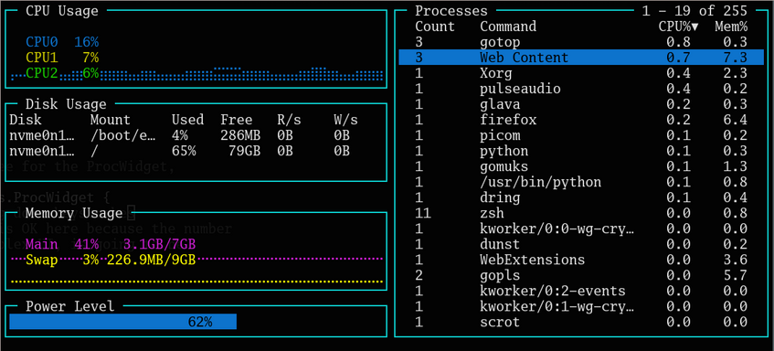

<div align="center">

<a href="./assets/logo">
    
</a>
<br><br>

Another terminal based graphical activity monitor, inspired by [gtop](https://github.com/aksakalli/gtop) and [vtop](https://github.com/MrRio/vtop), this time written in [Go](https://golang.org/)!

The original author of gotop has re-implemented the application in Rust, as [ytop](https://github.com/cjbassi/ytop).  This is a fork of original gotop project with a new maintainer.


</div>

## Installation


Working and tested on Linux, FreeBSD and MacOS. Windows binaries are provided, but have limited testing. OpenBSD works with some caveats; cross-compiling is difficult and binaries are not provided.

### Arch

AUR contains entries for `gotop` and `gotop-bin`.  `gotop-git` still points at the old, unmaintained, repository for the moment.

```
yay -S gotop-bin
```

There is also a build-from-source package:

```
yay -S gotop
```

### OSX

gotop can be installed with [Homebrew](https://brew.sh/); you'll need to tap the recipe. If you'd previously tapped cjbassi's recipe, you'll want to untap that first.  The old version of gotop is also included in Homebrew's core library, and that will always be chosen before any taps, so you have to specify the tap specifically.

```
brew uninstall gotop        # If previously installed
brew untap cjbassi/gotop    # If previously tapped
brew tap xxxserxxx/gotop
brew install xxxserxxx/gotop
```

### Prebuilt binaries

This doesn't require Go, is easy, and works across distributions. You have to manually upgrade the executable yourself, though, so using your distribution's package (if one is available) is a better approach.

Visit [the releases page](https://github.com/xxxserxxx/gotop/releases) with your web browser and download the appropriate file for your OS and architecture.  Unzip it (the archive contains a single file) and then move the resulting `gotop` binary into your `$PATH` somewhere.  If you're on a Debian or Redhat derivative, you can download an `.rpm` or `.deb` and install that.

### Source

This requires Go, and at the moment, Go 1.14 specifically.  

```bash
go get -u github.com/xxxserxxx/gotop/cmd/gotop
```

If you don't have Go 1.14, you will want to follow the Building instructions in the next section.

### Building

This is the download & compile approach.

gotop should build with most versions of Go.  If you have a version other than 1.14 installed, remove the `go` line at the end of `go.mod`.

```
git clone https://github.com/xxxserxxx/gotop.git
cd gotop
sed -i '/^go/d' go.mod          # Do this if you have go != 1.14
go build -o gotop ./cmd/gotop
```

Move `gotop` to somewhere in your `$PATH`.

## Usage

### Keybinds

- Quit: `q` or `<C-c>`
- Process navigation:
  - `k` and `<Up>`: up
  - `j` and `<Down>`: down
  - `<C-u>`: half page up
  - `<C-d>`: half page down
  - `<C-b>`: full page up
  - `<C-f>`: full page down
  - `gg` and `<Home>`: jump to top
  - `G` and `<End>`: jump to bottom
- Process actions:
  - `<Tab>`: toggle process grouping
  - `dd`: kill selected process or group of processes with SIGTERM
  - `d3`: kill selected process or group of processes with SIGQUIT
  - `d9`: kill selected process or group of processes with SIGKILL
- Process sorting
  - `c`: CPU
  - `m`: Mem
  - `p`: PID
- Process filtering:
  - `/`: start editing filter
  - (while editing):
    - `<Enter>` accept filter
    - `<C-c>` and `<Escape>`: clear filter
- CPU and Mem graph scaling:
  - `h`: scale in
  - `l`: scale out
- `?`: toggles keybind help menu

### Mouse

- click to select process
- mouse wheel to scroll through processes

### Colorschemes

gotop ships with a few colorschemes which can be set with the `-c` flag followed by the name of one. You can find all the colorschemes in the [colorschemes folder](./colorschemes).

To make a custom colorscheme, check out the [template](./colorschemes/template.go) for instructions and then use [default.json](./colorschemes/default.json) as a starter. Then put the file at `~/.config/gotop/<name>.json` and load it with `gotop -c <name>`. Colorschemes PR's are welcome!

### Layouts

gotop can parse and render layouts from a specification file.  The format is
intentionally simple.  The amount of nesting levels is limited.  Some examples
are in the `layouts` directory; you can try each of these with, e.g.,
`gotop --layout-file layouts/procs`.  If you stick your layouts in
`$XDG_CONFIG_HOME/gotop`, you can reference them on the command line with the
`-l` argument, e.g. `gotop -l procs`.

The syntax for each widget in a row is:
```
(rowspan:)?widget(/weight)?
```
and these are separated by spaces.

1. Each line is a row
2. Empty lines are skipped
3. Spaces are compressed (so you can do limited visual formatting)
4. Legal widget names are: cpu, disk, mem, temp, batt, net, procs
5. Widget names are not case sensitive
4. The simplest row is a single widget, by name, e.g.
   ```
   cpu
   ```
5. **Weights**
    1. Widgets with no weights have a weight of 1.
    2. If multiple widgets are put on a row with no weights, they will all have
       the same width.
    3. Weights are integers
    4. A widget will have a width proportional to its weight divided by the
       total weight count of the row. E.g.,
       ```
       cpu      net
       disk/2   mem/4
       ```
       The first row will have two widgets: the CPU and network widgets; each
       will be 50% of the total width wide.  The second row will have two
       widgets: disk and memory; the first will be 2/6 ~= 33% wide, and the
       second will be 5/7 ~= 67% wide (or, memory will be twice as wide as disk).
9. If prefixed by a number and colon, the widget will span that number of
   rows downward. E.g.
   ```
   mem   2:cpu
   net
   ```
   Here, memory and network will be in the same row as CPU, one over the other,
   and each half as high as CPU; it'll look like this:
   ```
    +------+------+
    | Mem  |      |
    +------+ CPU  |
    | Net  |      |
    +------+------+
   ```
10. Negative, 0, or non-integer weights will be recorded as "1".  Same for row
    spans. 
11. Unrecognized widget names will cause the application to abort.                          
12. In rows with multi-row spanning widgets **and** weights, weights in
    lower rows are ignored.  Put the weight on the widgets in that row, not
    in later (spanned) rows.
13. Widgets are filled in top down, left-to-right order.
14. The larges row span in a row defines the top-level row span; all smaller
    row spans constitude sub-rows in the row. For example, `cpu mem/3 net/5`
    means that net/5 will be 5 rows tall overall, and mem will compose 3 of
    them. If following rows do not have enough widgets to fill the gaps,
    spacers will be used.

Yes, you're clever enough to break the layout algorithm, but if you try to
build massive edifices, you're in for disappointment.

### CLI Options

`-c`, `--color=NAME` Set a colorscheme.  
`-m`, `--minimal` Only show CPU, Mem and Process widgets.  (DEPRECATED, use `-l minimal`)  
`-r`, `--rate=RATE` Number of times per second to update CPU and Mem widgets [default: 1].  
`-V`, `--version` Print version and exit.  
`-p`, `--percpu` Show each CPU in the CPU widget.  
`-a`, `--averagecpu` Show average CPU in the CPU widget.  
`-f`, `--fahrenheit` Show temperatures in fahrenheit.  
`-s`, `--statusbar` Show a statusbar with the time.  
`-b`, `--battery` Show battery level widget (`minimal` turns off). (DEPRECATED, use `-l battery`)  
`-i`, `--interface=NAME` Select network interface [default: all].  
`-l`, `--layout=NAME` Choose a layout. gotop searches for a file by NAME in \$XDG_CONFIG_HOME/gotop, then relative to the current path. "-" reads a layout from stdin, allowing for simple, one-off layouts such as `echo net | gotop -l -`

Several interfaces can be defined using comma separated values.

Interfaces can also be ignored using `!`

## More screen shots

#### "-l battery"


#### "-l minimal"


#### Custom (layouts/procs)


## Built With

- [gizak/termui](https://github.com/gizak/termui)
- [nsf/termbox](https://github.com/nsf/termbox-go)
- [exrook/drawille-go](https://github.com/exrook/drawille-go)
- [shirou/gopsutil](https://github.com/shirou/gopsutil)
- [goreleaser/nfpm](https://github.com/goreleaser/nfpm)
- [distatus/battery](https://github.com/distatus/battery)

## Stargazers over time

[](https://starcharts.herokuapp.com/xxxserxxx/gotop)
